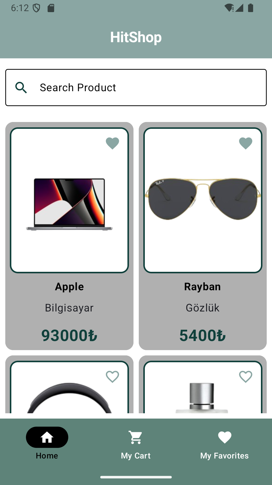
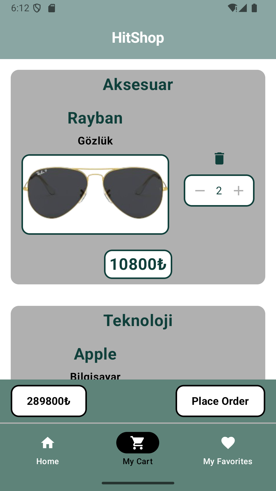
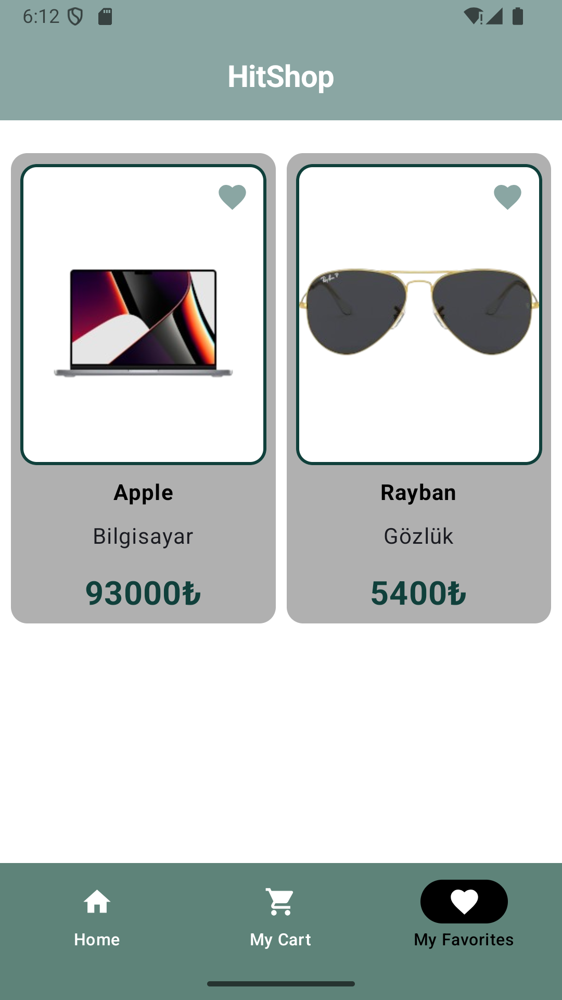
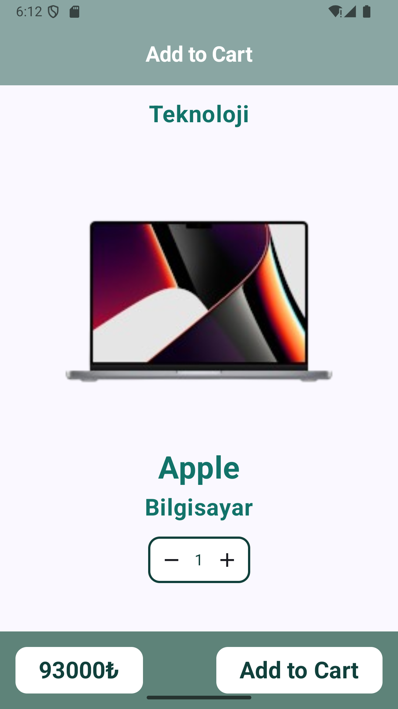
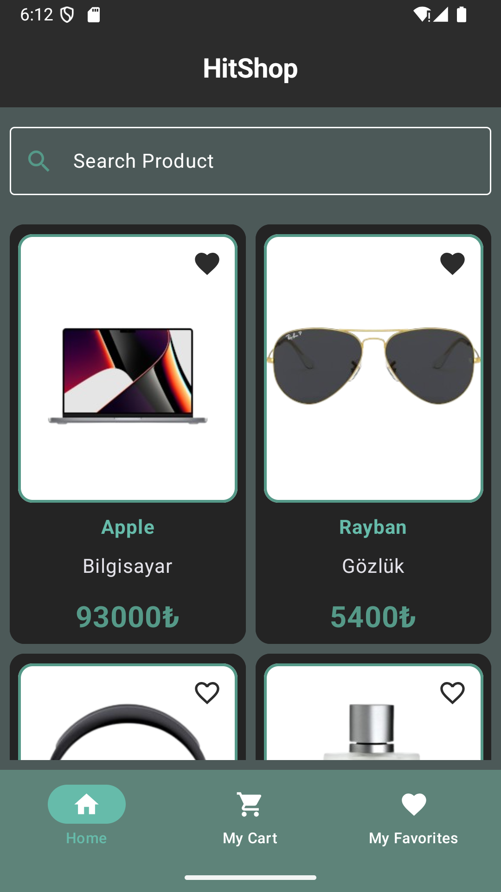
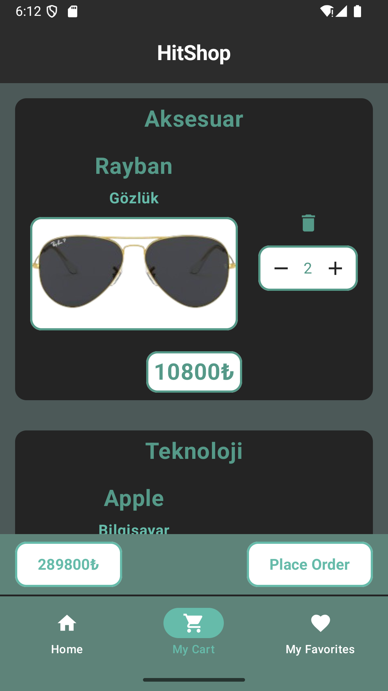
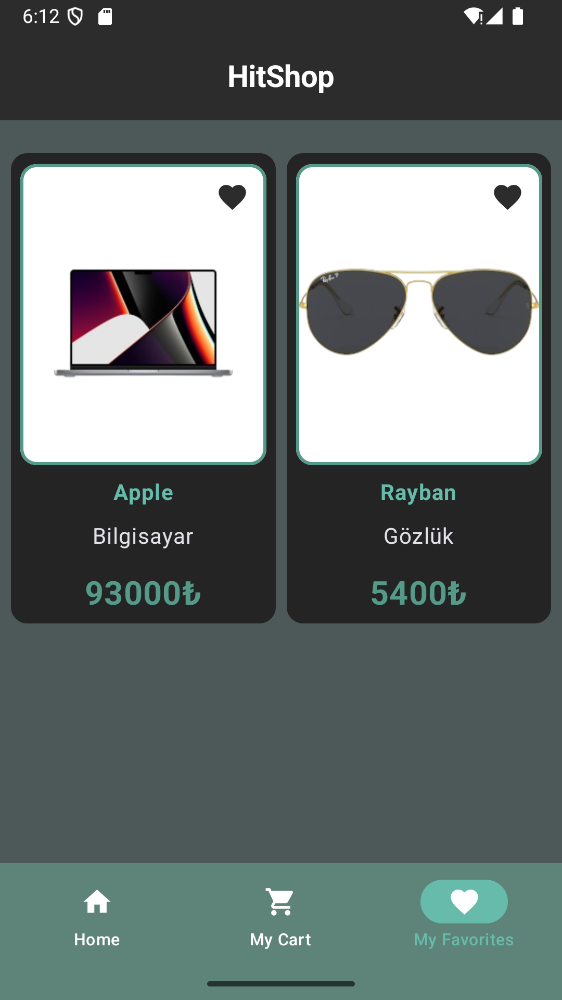
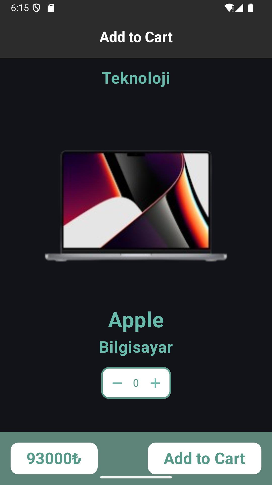

# HitShop

## English

### Overview
**HitShop** is a modern e-commerce mobile application inspired by platforms like **Trendyol**.  
It allows users to browse products, search, view details, and add items to their favorites — all within a sleek, user-friendly interface.  
The app is built using **Jetpack Compose** with **MVVM Clean Architecture** and incorporates best Android development practices.

---

### Features
- Product listing and detail pages
- Add/remove favorites
- Real-time product search
- Full light & dark mode support
- Local data persistence with Room
- Clean architecture with ViewModel, Repository, and UseCase layers
- Dependency injection with **Dagger-Hilt**

---

### Features
| Category | Technologies |
|-----------|--------------|
| Language | Kotlin |
| UI | Jetpack Compose, Material 3 |
| Architecture | MVVM Clean Architecture |
| Dependency Injection | Dagger-Hilt |
| Async | Coroutines, LiveData |
| State Management | State & MutableState |
| Database | Room |
| Networking & APIs | Retrofit, Web Services, Room |
| English And Turkish language support | Yes |


### Screenshots

####  Light Mode
<p align="center">
  
  
  
  
</p>

####  Dark Mode
<p align="center">
  
  
  
  
</p>

---

### Architecture
The project follows **MVVM Clean Architecture**, consisting of:
<<<<<<< HEAD
- **UI Layer (Compose)** — reactive UI using State and observing LiveData
- **ViewModels** — each screen has its own ViewModel, manages LiveData
- **Data Layer** — repositories, data sources, and entities

=======
- **UI Layer (Compose)** — reactive UI using State and LiveData for observing new value
- **Data Layer** — repositories, data sources,entity
- **ViewModel Layer** viewmodels for every screen and manage LiveData
>>>>>>> d9255f8 (MainViewmodel has uploaded for improving UI)

This structure improves testability, scalability, and maintainability.

---

###  Installation
```bash
git clone https://github.com/eraykstrl/HitShop-ECommerce.git
